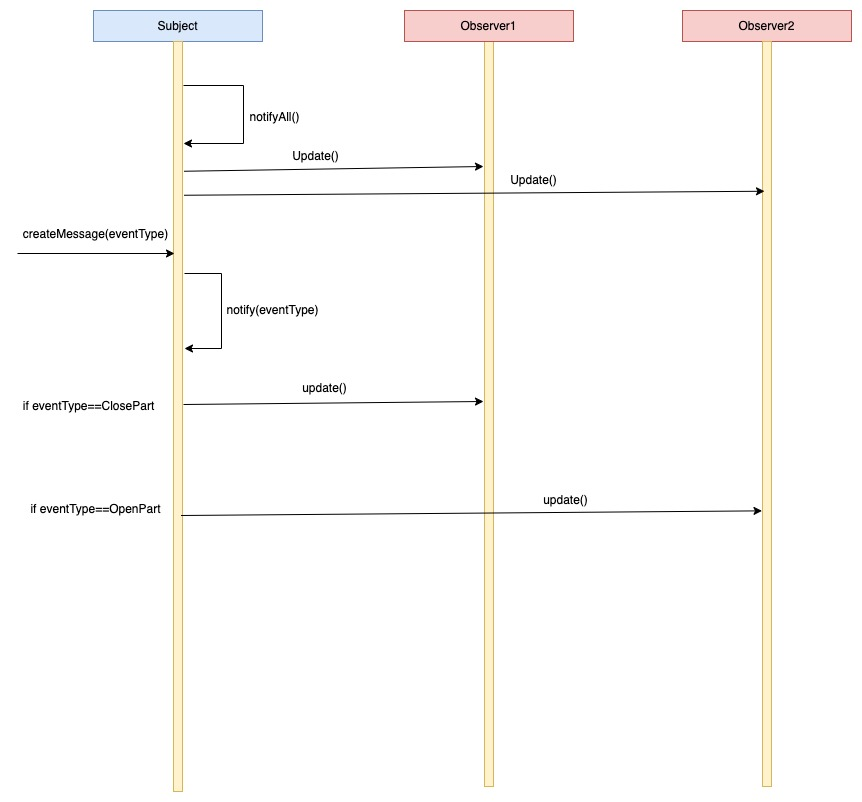

# Design Document

### Goal:
 To Make the Observer functionality more generic.

 

### Requirements:
- All core Observer services should be in libcore 
- Application specific portions of Observer should be in appropriate libraries (i.e. not libcore) 
- Need to have a High level Session object. So application specific observers are not registered on CoreSession.
- Implement a second use case for observers to show that core functionality is isolated, but can be extensible. 

 

### UML Diagram of Generic Observer Pattern:

### Project Functionality Diagram:

